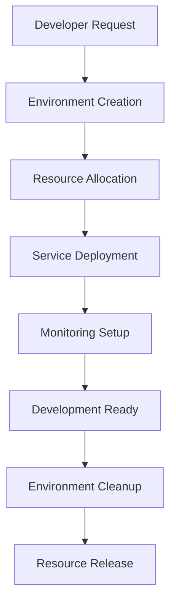

# **AI-SDLC System Architecture Document**

## **1. Introduction**

### **1.1 Purpose**
This document provides a comprehensive technical overview of the **AI-Driven Software Development Lifecycle (AI-SDLC)** system. It outlines the architecture, system components, deployment model, infrastructure, and security measures that guide developers in building and maintaining the system.

### **1.2 Scope**
The AI-SDLC system integrates AI-driven automation across all phases of software development: planning, coding, testing, deployment, and monitoring. It follows a **microservices-based, cloud-native** design to ensure scalability, high availability, and fault tolerance.

### **1.3 System Overview**
- **Frontend**: VS Code Extension, Web Dashboard (Next.js, React)
- **Backend**: FastAPI (Python), Node.js (GraphQL, REST API services)
- **Database**: PostgreSQL for persistent storage, Redis for caching
- **AI Engine**: OpenAI GPT-4, Claude 3, Mistral 7B
- **CI/CD Pipelines**: GitHub Actions, Jenkins
- **Infrastructure**: Docker, Kubernetes
- **Monitoring & Logging**: Prometheus, ELK Stack

---

## **2. System Architecture Overview**

### **2.1 High-Level Architecture**
```
+-----------------+       +-----------------+       +-----------------+
|  AI Assistant  | <---> | AI Mediator API | <---> | AI Model Engine |
+-----------------+       +-----------------+       +-----------------+
       |                          |                          |
       v                          v                          v
+-----------------+       +-----------------+       +-----------------+
|   Frontend UI  | <---> |    Backend API  | <---> |  Database Layer |
+-----------------+       +-----------------+       +-----------------+
```

### **2.2 Key Components**

#### **Frontend (VS Code Extension & Web Dashboard)**
- **User Interface** for AI-assisted development, debugging, and automation.
- **Technology Stack:** Next.js (React), TypeScript, TailwindCSS.
- **Features:**
  - AI-powered chat interface for code suggestions.
  - Real-time tracking of AI-generated changes.
  - Dashboard for monitoring AI-automated development activities.

#### **Backend API**
- **Manages API interactions, AI requests, and user authentication.**
- **Technology Stack:** FastAPI (Python) and Node.js.
- **Key Services:**
  - RESTful & GraphQL API services.
  - Authentication via OAuth2 and JWT tokens.
  - AI-mediated request handling and routing.

#### **AI Model Engine & AI Mediator**
- **Optimizes and routes AI interactions to the most suitable model.**
- **Technology Stack:** LangChain, OpenAI API, Hugging Face models.
- **Functions:**
  - Smart token optimization and AI model selection.
  - AI response caching for improved efficiency.

#### **Database Layer**
- **Stores AI-generated responses, system logs, and user interaction history.**
- **Technology Stack:** PostgreSQL (primary), Redis (caching layer).
- **Schema Design:**
  - `users` (User authentication and access control).
  - `projects` (Tracks project requirements and AI-generated components).
  - `ai_logs` (Stores AI activity and past interactions).

#### **CI/CD & Deployment Pipeline**
- **Automates testing, builds, and deployments.**
- **Technology Stack:** GitHub Actions, Jenkins, Docker, Kubernetes.
- **Features:**
  - Automated AI-powered testing and PR approvals.
  - Blue-green deployment with rollback support.

#### **Monitoring & Logging**
- **Ensures system reliability and security through active monitoring.**
- **Technology Stack:** Prometheus (performance monitoring), ELK Stack (logging and analytics).
- **Functions:**
  - AI-driven anomaly detection.
  - Log aggregation for debugging and auditing.

---

## **3. Data Flow & System Interactions**

### **3.1 User Workflow**
1. **User Requests AI Assistance** → Developer interacts with AI via **VS Code Extension** or **Web Dashboard**.
2. **AI Processing** → AI Mediator routes request to the appropriate AI model.
3. **AI Model Execution** → AI generates a response based on stored context and past interactions.
4. **Response Handling** → AI output is logged and sent back to the user for validation.
5. **Code Deployment** → AI can **automate PR creation, testing, and CI/CD workflows**.
6. **Monitoring & Continuous Learning** → AI refines recommendations based on user feedback.

### **3.2 AI Model Selection Logic**
| **Use Case**         | **Preferred AI Model** |
|----------------------|----------------------|
| Code Generation     | GPT-4 Turbo          |
| Code Review        | Claude 3 Opus        |
| Test Case Creation | Mistral 7B           |
| Bug Detection      | AI-Powered Static Analysis |
| CI/CD Optimization | AI Workload Prediction Engine |

---

## **4. Deployment Architecture**

### **4.1 Cloud Infrastructure**
| **Component** | **Technology Stack** |
|--------------|---------------------|
| Containerization | Docker, Kubernetes |
| API Hosting | AWS Lambda, EC2, GCP Cloud Run |
| Database | PostgreSQL, Redis |
| AI Processing | OpenAI API, Hugging Face Models |
| CI/CD | GitHub Actions, Jenkins |

### **4.2 Development Environment Orchestration**

#### **🔹 Environment Management Tools**
- **Local Development**:
  - Docker Compose for service orchestration
  - VS Code with Remote Containers
  - Hot-reload development servers
- **Staging/Production**:
  - Kubernetes for container orchestration
  - Helm charts for deployment management
  - Terraform for infrastructure provisioning

#### **🔹 Resource Allocation Strategy**
```yaml
environments:
  development:
    resources:
      small:
        cpu: "2"
        memory: "4Gi"
        storage: "20Gi"
      medium:
        cpu: "4"
        memory: "8Gi"
        storage: "50Gi"
    tools:
      - docker-compose
      - vscode
      - git
  staging:
    resources:
      cpu: "4"
      memory: "8Gi"
      storage: "100Gi"
    tools:
      - kubernetes
      - helm
      - prometheus
```

#### **🔹 Environment Lifecycle Flow**


#### **🔹 CI/CD Pipeline Integration**
- **Environment Creation Pipeline**:
  1. Developer initiates request via CLI/Dashboard
  2. Pipeline validates resource availability
  3. Provisions infrastructure using Terraform
  4. Deploys services via Kubernetes/Docker Compose
  5. Configures monitoring and logging
  6. Runs integration tests
  7. Provides access credentials

- **Environment Management**:
  - Automated scaling based on resource usage
  - Regular health checks and monitoring
  - Automatic cleanup of unused environments
  - Backup and restore capabilities

### **4.3 Scalability & Fault Tolerance**
- **Auto-scaling Kubernetes clusters** for AI workloads.
- **Failover replication for PostgreSQL database**.
- **Rate-limiting and caching for AI API calls** to optimize performance.

---

## **5. Security Considerations**

### **5.1 Authentication & Authorization**
- OAuth2-based authentication.
- JWT tokens for secure API communication.
- Role-Based Access Control (RBAC) for developers, tech leads, and managers.

### **5.2 Data Protection & Compliance**
- Encryption of AI-generated data (AES-256).
- Compliance with GDPR, SOC2, and ISO 27001 security standards.
- Secure API keys stored using AWS Secrets Manager.

### **5.3 AI Model Security**
- Rate limiting and request validation before AI API calls.
- Logging and auditing AI-driven changes for accountability.

---

## **6. Future Enhancements**
- **AI-driven predictive debugging** – Detects potential issues before execution.
- **AI-managed cloud cost optimization** – Predicts infrastructure cost savings.
- **Real-time AI feedback learning** – Improves AI recommendations based on usage patterns.

---

## **7. Approval & Next Steps**
✅ **Review architecture with engineering team**
✅ **Implement AI integration layer**
✅ **Set up Kubernetes deployment & CI/CD pipeline**

🚀 **Would you like any refinements before we proceed to implementation?**
