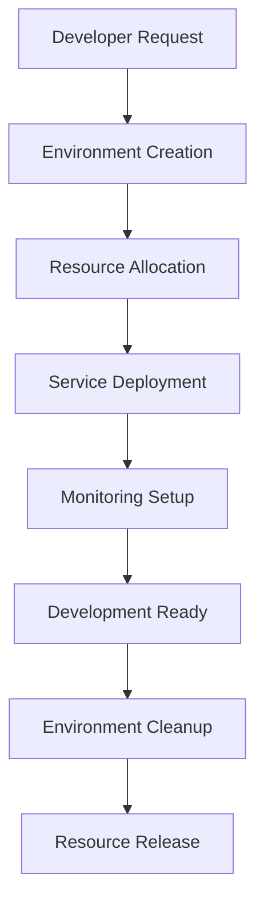

# **AI-SDLC System Architecture Document**

[Previous sections remain the same up to Section 4]

## **4. Deployment Architecture**

### **4.1 Cloud Infrastructure**
| **Component** | **Technology Stack** |
|--------------|---------------------|
| Containerization | Docker, Kubernetes |
| API Hosting | AWS Lambda, EC2, GCP Cloud Run |
| Database | PostgreSQL, Redis |
| AI Processing | OpenAI API, Hugging Face Models |
| CI/CD | GitHub Actions, Jenkins |

### **4.2 Development Environment Orchestration**

#### **🔹 Environment Management Tools**
- **Local Development**:
  - Docker Compose for service orchestration
  - VS Code with Remote Containers
  - Hot-reload development servers
- **Staging/Production**:
  - Kubernetes for container orchestration
  - Helm charts for deployment management
  - Terraform for infrastructure provisioning

#### **🔹 Resource Allocation Strategy**
```yaml
environments:
  development:
    resources:
      small:
        cpu: "2"
        memory: "4Gi"
        storage: "20Gi"
      medium:
        cpu: "4"
        memory: "8Gi"
        storage: "50Gi"
    tools:
      - docker-compose
      - vscode
      - git
  staging:
    resources:
      cpu: "4"
        memory: "8Gi"
        storage: "100Gi"
    tools:
      - kubernetes
      - helm
      - prometheus
```

#### **🔹 Environment Lifecycle Flow**


#### **🔹 CI/CD Pipeline Integration**
- **Environment Creation Pipeline**:
  1. Developer initiates request via CLI/Dashboard
  2. Pipeline validates resource availability
  3. Provisions infrastructure using Terraform
  4. Deploys services via Kubernetes/Docker Compose
  5. Configures monitoring and logging
  6. Runs integration tests
  7. Provides access credentials

- **Environment Management**:
  - Automated scaling based on resource usage
  - Regular health checks and monitoring
  - Automatic cleanup of unused environments
  - Backup and restore capabilities

### **4.3 Scalability & Fault Tolerance**
- **Auto-scaling Kubernetes clusters** for AI workloads.
- **Failover replication for PostgreSQL database**.
- **Rate-limiting and caching for AI API calls** to optimize performance.

[Rest of the document remains the same]
