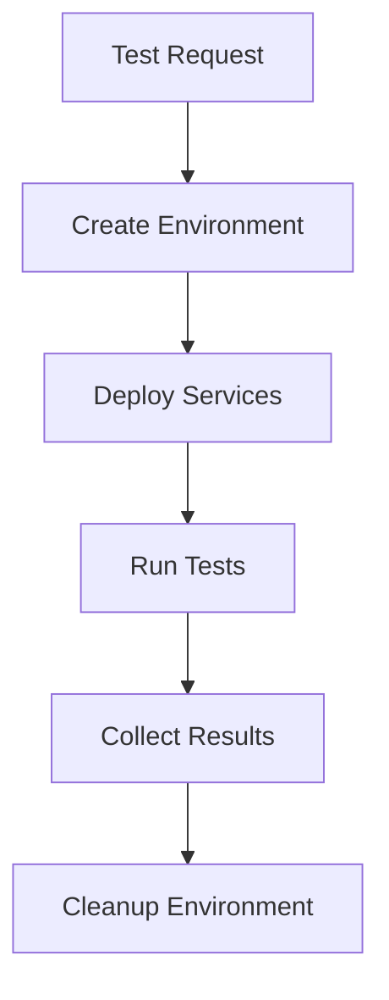

# **Integration Testing Guide for AI-SDLC**

[Previous sections 1-3 remain the same]

### **3.3 Containerized Testing Environments**
📌 **Docker-Based Testing:**
```yaml
services:
  test-environment:
    build:
      context: .
      dockerfile: Dockerfile.test
    volumes:
      - ./tests:/app/tests
      - test-results:/app/results
    environment:
      - TEST_ENV=integration
      - DB_HOST=test-db
    depends_on:
      - test-db
      - test-cache
```

📌 **Kubernetes Testing Pods:**
```yaml
apiVersion: v1
kind: Pod
metadata:
  name: integration-test-pod
spec:
  containers:
  - name: test-runner
    image: ai-sdlc-test:latest
    env:
    - name: TEST_ENV
      value: "integration"
    volumeMounts:
    - name: test-results
      mountPath: /app/results
  volumes:
  - name: test-results
    persistentVolumeClaim:
      claimName: test-results-pvc
```

### **3.4 Dynamic Environment Testing**
📌 **Environment Creation Tools:**
| **Tool** | **Purpose** |
|---------|-------------|
| TestContainers | Manages containerized test dependencies |
| LocalStack | Simulates AWS services for testing |
| K3d | Lightweight Kubernetes for test environments |

📌 **Test Environment Lifecycle:**


[Previous sections 4-8 remain the same with enhanced testing components section]

### **4.3 Environment-Specific Testing**
📌 **Container-Based Testing Strategy:**
- **Isolation**: Each test suite runs in dedicated containers
- **Resource Management**: Defined CPU/Memory limits
- **State Management**: Ephemeral storage for test data
- **Network Isolation**: Dedicated test networks

📌 **VM-Based Testing Approach:**
- **Full System Testing**: Complete environment simulation
- **Long-Running Tests**: Persistent test environments
- **Resource-Intensive Tests**: Full system resources
- **Legacy System Testing**: OS-level compatibility

[Rest of the document remains the same]
